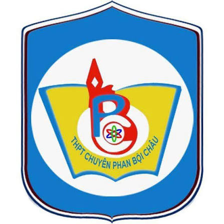

# Website Giới Thiệu Trường THPT Chuyên Phan Bội Châu - Nghệ An

<div align="center">
  
  <h3>TRƯỜNG THPT CHUYÊN PHAN BỘI CHÂU - TỈNH NGHỆ AN</h3>
  <p><em>"Nơi nuôi dưỡng tài năng và khát vọng"</em></p>

  [](https://github.com/hongquang699/PhanBoiChauSchool)
  [](LICENSE)
  [](https://python.org)
  []()
</div>

---

## 📌 Giới Thiệu

Website chính thức giới thiệu **Trường THPT Chuyên Phan Bội Châu (Nghệ An)** – một trong những ngôi trường chuyên giàu truyền thống hiếu học và thành tích hàng đầu Việt Nam. Website cung cấp đầy đủ thông tin về lịch sử nhà trường, cơ cấu tổ chức, đội ngũ giáo viên, hoạt động học tập của học sinh, bảng vàng thành tích các kỳ thi Quốc gia & Quốc tế, thông tin tuyển sinh, câu lạc bộ ngoại khóa và hệ thống bảo mật hiện đại.

---

## ✨ Tính Năng Nổi Bật

- **Giao diện hiện đại & Thân thiện**: Tương thích hoàn toàn trên Desktop, Tablet và Mobile (Responsive Design).
- **Bộ nhận diện chuẩn hóa**: Logo, màu sắc chủ đạo đồng bộ, hình ảnh chất lượng cao và video tư liệu sinh động.
- **Hệ thống chuyên mục toàn diện**:
  - Trang chủ tin tức, sự kiện nổi bật, câu lạc bộ học sinh, thư viện ảnh kỷ yếu.
  - Trang chi tiết: Giới thiệu, Đội ngũ Giáo viên, Học sinh & CLB, Học tập, Thành tích, Tuyển sinh, Địa điểm trường, Thư viện, Liên hệ.
- **Bộ lọc & Tìm kiếm linh hoạt**: Hỗ trợ lọc giáo viên theo tổ bộ môn, lọc thành tích theo năm và cấp giải thưởng.
- **Khởi chạy siêu tốc (1-Click Run)**: Có sẵn file thực thi `CHAY_WEB.bat` giúp mở máy chủ phát triển và tự động mở trình duyệt.
- **Hệ thống phòng thủ bảo mật đa lớp (Multi-layer Security)**: Tích hợp sẵn middleware bảo mật kiểm thử cho máy chủ phát triển (chống SQLi, XSS, CSRF, Path Traversal, Brute Force, Rate Limiting, Upload Scanning).

---

## 📂 Danh Sách Các Trang Web

| Trang | File HTML | Mô Tả |
|---|---|---|
| **Trang chủ** | `index.html` | Cổng thông tin chính, banner sự kiện, giới thiệu tóm tắt, CLB, tin tức |
| **Giới thiệu** | `pages/gioi-thieu.html` | Lịch sử hình thành, tầm nhìn - sứ mệnh, cơ cấu tổ chức, cơ sở vật chất |
| **Giáo viên** | `pages/giao-vien.html` | Đội ngũ cán bộ, Ban giám hiệu, giáo viên các tổ chuyên môn |
| **Học sinh & CLB** | `pages/hoc-sinh.html` | Hoạt động Đoàn, các CLB học thuật, nghệ thuật, tình nguyện (CP The News, MUN, PBO...) |
| **Học tập** | `pages/hoc-tap.html` | Chương trình đào tạo chuyên sâu, phương pháp học tập, tài liệu tham khảo |
| **Thành tích** | `pages/thanh-tich.html` | Bảng vàng vinh danh Olympic Quốc tế, HSG Quốc gia qua các thời kỳ |
| **Tuyển sinh** | `pages/tuyen-sinh.html` | Chỉ tiêu, quy chế thi tuyển vào lớp 10 chuyên hàng năm |
| **Địa điểm** | `pages/dia-diem.html` | Bản đồ khuôn viên, hướng dẫn đường đi tới trường tại TP. Vinh |
| **Thư viện** | `pages/thu-vien.html` | Thư viện sách, tài liệu số và kho ảnh truyền thống trường |
| **Tin tức** | `pages/tin-tuc.html` | Bản tin sự kiện, thông báo mới nhất của nhà trường |
| **Liên hệ** | `pages/lien-he.html` | Thông tin liên lạc, form gửi thư đóng góp ý kiến |

---

## 🛡️ Hệ Thống Bảo Mật Tích Hợp (`/security`)

Dự án được xây dựng kèm bộ giải pháp phòng chống tấn công mạng toàn diện:
- **Rate Limiting & Anti-DDoS**: Giới hạn số lượng truy vấn/phút theo IP để bảo vệ máy chủ.
- **SQL Injection Prevention**: Chuẩn hóa truy vấn tham số hóa và kiểm soát đầu vào nghiêm ngặt.
- **XSS & Content Filtering**: Bộ lọc làm sạch dữ liệu đầu vào và các trường hiển thị ra HTML.
- **CSRF Token Guard**: Tạo và kiểm thực token CSRF cho các form gửi dữ liệu.
- **Brute Force Protection**: Tự động khóa IP khi phát hiện nhiều lần thử đăng nhập/truy cập bất thường.
- **Path Traversal Shield**: Ngăn chặn tuyệt đối việc đọc trái phép các tệp nhạy cảm trong hệ điều hành.
- **Upload File Validation**: Kiểm tra MIME-type, định dạng phần mở rộng và mã độc đối với tệp tải lên.
- **Audit Logging & Security Alert**: Ghi nhật ký sự kiện bảo mật theo định dạng chuẩn JSONL/Log.
- **Automated Backup**: Kịch bản sao lưu tự động tệp tin cấu hình và dữ liệu.

*(Xem chi tiết kiến trúc bảo mật tại `security/SECURITY_ARCHITECTURE.md`)*

---

## 📁 Cấu Trúc Thư Mục Dự Án

```plaintext
gioithieuPBC/
│
├── index.html                  # Trang chủ chính
├── CHAY_WEB.bat                # Kịch bản chạy nhanh web 1-click
├── run.bat                     # Kịch bản chạy server dự phòng
├── dev_server.py               # Máy chủ Python HTTP kèm middleware bảo mật
├── test_security_server.py     # Script kiểm thử tự động các lớp bảo mật
├── fb_logos.json               # Dữ liệu logo CLB
├── .gitignore                  # Cấu hình bỏ qua tệp tạm, logs, backups
├── README.md                   # Tài liệu hướng dẫn dự án
│
├── css/                        # Bảng định kiểu CSS
│   ├── style.css               # Phong cách giao diện chính
│   ├── components.css          # Các thành phần tái sử dụng (Button, Card, Modal...)
│   └── responsive.css          # Điều chỉnh hiển thị cho di động & máy tính bảng
│
├── js/                         # Mã xử lý Javascript
│   ├── main.js                 # Xử lý sự kiện, menu, slider, cuộn mượt
│   └── filter.js               # Bộ lọc giáo viên & bảng thành tích
│
├── pages/                      # Các trang giao diện con
│   ├── gioi-thieu.html
│   ├── giao-vien.html
│   ├── hoc-sinh.html
│   ├── hoc-tap.html
│   ├── thanh-tich.html
│   ├── tuyen-sinh.html
│   ├── tin-tuc.html
│   ├── thu-vien.html
│   ├── dia-diem.html
│   └── lien-he.html
│
├── images/                     # Tài nguyên hình ảnh
│   ├── logo/                   # Huy hiệu & Logo trường
│   ├── banner/                 # Hình ảnh khuôn viên & tượng cụ Phan
│   ├── clubs/                  # Logo & ảnh các câu lạc bộ học sinh
│   ├── gallery/                # Bộ sưu tập kỷ yếu & khoảnh khắc
│   ├── news/                   # Ảnh minh họa tin tức
│   └── teachers/               # Chân dung Ban Giám hiệu & thầy cô
│
├── videos/                     # Tài nguyên video tư liệu
│   └── video-tu-lieu-pbc.mp4
│
├── security/                   # Module bảo mật mã nguồn
│   ├── SECURITY_ARCHITECTURE.md# Tài liệu giải thích kiến trúc bảo mật
│   ├── app_security.py         # Bộ điều phối bảo mật trung tâm
│   ├── rate_limiter.py         # Giới hạn tần suất request
│   ├── xss_protection.py       # Phòng chống tấn công XSS
│   ├── sqli_protection.py      # Phòng chống tấn công SQL Injection
│   ├── csrf_protection.py      # Bảo vệ chống giả mạo request
│   ├── path_traversal_protection.py # Ngăn ngừa truy cập tệp tùy ý
│   ├── brute_force_protection.py    # Chống dò mật khẩu / brute force
│   ├── upload_security.py      # Kiểm soát an toàn tệp tải lên
│   ├── backup.py               # Tự động hóa sao lưu dữ liệu
│   ├── logger.py               # Ghi nhật ký bảo mật
│   ├── nginx.conf              # Cấu hình mẫu Nginx
│   └── waf_rules.conf          # Luật WAF cho môi trường Production
│
└── scripts/                    # Các tập lệnh bổ trợ
    └── fetch_logos.py
```

---

## 🚀 Hướng Dẫn Cài Đặt & Khởi Chạy

### Cách 1: Sử dụng tập lệnh 1-Click (Khuyên dùng trên Windows)
1. Tải hoặc sao chép mã nguồn về máy:
   ```bash
   git clone https://github.com/hongquang699/PhanBoiChauSchool.git
   ```
2. Nhấp đúp chuột vào tệp:
   ```plaintext
   CHAY_WEB.bat
   ```
3. Trình duyệt web sẽ tự động mở địa chỉ: `http://localhost:8080`.

---

### Cách 2: Khởi chạy bằng dòng lệnh Terminal / PowerShell
Yêu cầu máy tính đã cài đặt [Python 3](https://www.python.org/downloads/):

```bash
# Di chuyển vào thư mục dự án
cd gioithieuPBC

# Chạy máy chủ kiểm thử bảo mật
python dev_server.py
```
Hoặc sử dụng máy chủ HTTP mặc định:
```bash
python -m http.server 8080
```
Sau đó truy cập: [http://localhost:8080](http://localhost:8080)

---

### Chạy Kiểm Thử Bộ Bảo Mật (Security Tests)
Để xác nhận tính hợp lệ của tất cả các module an toàn thông tin:
```bash
python test_security_server.py
```

---

## 🛠️ Công Nghệ Sử Dụng

- **Frontend**: HTML5, CSS3 (Flexbox & CSS Grid), Vanilla JavaScript (ES6+).
- **Icons & Fonts**: [Font Awesome 6](https://fontawesome.com/), Google Fonts (Montserrat, Roboto).
- **Backend / Dev Server**: Python 3 HTTP Server kết hợp Custom Security Middleware.
- **Deployment**: Tương thích GitHub Pages, Vercel, Netlify, Apache và Nginx.

---

## 📞 Thông Tin Liên Hệ

- **Trường THPT Chuyên Phan Bội Châu - Tỉnh Nghệ An**
- **Địa chỉ**: Số 119 Đường Lê Hồng Phong, Thành phố Vinh, Tỉnh Nghệ An
- **Điện thoại**: (0238) 3844.897
- **Email**: c3chuyenpbc@nghean.edu.vn
- **Website chính thức**: [https://thptchuyenphanboichau.edu.vn/](https://thptchuyenphanboichau.edu.vn/)

---
*Dự án được xây dựng và đóng góp nhằm lan tỏa truyền thống hiếu học và tự hào về ngôi trường Chuyên Phan Bội Châu.*
