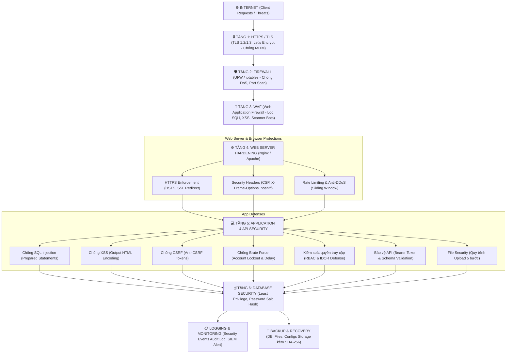

# KIẾN TRÚC BẢO MẬT HỆ THỐNG WEBSITE (SECURITY ARCHITECTURE)
## TRƯỜNG THPT CHUYÊN PHAN BỘI CHÂU - NGHỆ AN

---

## MỤC LỤC
1. [Phân loại Toàn diện 9 Nhóm Tấn công An ninh Mạng](#i-phân-loại-toàn-diện-9-nhóm-tấn-công-an-ninh-mạng)
2. [Mô hình Cây Bảo mật Chuẩn cho Website (Security Tree)](#ii-mô-hình-cây-bảo-mật-chuẩn-cho-website)
3. [Trọng tâm Bảo vệ then chốt khi Thiết kế Website (8 Trụ cột)](#iii-trọng-tâm-bảo-vệ-then-chốt-khi-thiết-kế-website)
4. [Sơ đồ Kiến trúc & Luồng Bảo vệ Đa tầng](#iv-sơ-đồ-kiến-trúc--luồng-bảo-vệ-đa-tầng)
5. [Chi tiết Các Lớp Phòng thủ (Security Protections)](#v-chi-tiết-các-lớp-phòng-thủ)
6. [Tổ chức File Mã nguồn Bảo mật trong Dự án](#vi-tổ-chức-file-mã-nguồn-bảo-mật-trong-dự-án)
7. [Ma trận Ánh xạ: Hình thức Tấn công & Biện pháp Phòng ngự](#vii-ma-trận-ánh-xạ-tấn-công--phòng-ngự)

---

## I. PHÂN LOẠI TOÀN DIỆN 9 NHÓM TẤN CÔNG AN NINH MẠNG

### 1. Tấn công vào tài khoản (Authentication & Identity Attacks)
- **Brute Force:** Kẻ tấn công thử liên tục rất nhiều mật khẩu (tự động hóa qua từ điển hoặc vét cạn ký tự) cho đến khi tìm được mật khẩu đúng.
- **Credential Stuffing:** Dùng danh sách cặp tài khoản/mật khẩu bị rò rỉ từ các dịch vụ khác (do thói quen người dùng đặt mật khẩu trùng lặp) để tự động thử đăng nhập hàng loạt vào website.
- **Password Spraying:** Thử một vài mật khẩu cực kỳ phổ biến (ví dụ: `123456`, `P@ssword123`, `Pbc@2026`) trên hàng loạt tài khoản khác nhau nhằm vượt qua cơ chế khóa tài khoản theo từng user.
- **Phishing (Tấn công giả mạo):** Giả mạo email, giao diện website trường học hoặc tin nhắn thông báo để lừa người dùng tự nguyện nhập thông tin đăng nhập và thông tin cá nhân.
- **Social Engineering (Khai thác tâm lý):** Đánh vào lòng tin, sự tò mò hoặc sự sợ hãi của người dùng (giáo viên, học sinh, quản trị viên) để lấy thông tin bí mật hoặc cấp quyền truy cập trái phép.

### 2. Tấn công website / ứng dụng web (Web Application Attacks)
- **SQL Injection (SQLi):** Chèn các câu lệnh SQL độc hại vào dữ liệu đầu vào của biểu mẫu hoặc tham số URL để can thiệp trực tiếp vào câu truy vấn cơ sở dữ liệu, đọc trộm hoặc xóa dữ liệu.
- **Cross-Site Scripting (XSS):** Đưa mã JavaScript độc hại vào nội dung được hiển thị cho người dùng, từ đó đánh cắp phiên đăng nhập (Session Hijacking/Cookies) hoặc chiếm quyền điều khiển trình duyệt nạn nhân.
- **Cross-Site Request Forgery (CSRF):** Lợi dụng phiên đăng nhập còn hiệu lực của nạn nhân để âm thầm thực hiện các hành động ngoài ý muốn (đổi mật khẩu, gửi bài viết, chuyển quyền) khi nạn nhân vô tình truy cập liên kết bẫy.
- **File Inclusion (LFI/RFI):** Lợi dụng chức năng tải/nhúng file để truy cập tài nguyên nội bộ trái phép (Local File Inclusion) hoặc nạp mã nguồn độc hại từ xa (Remote File Inclusion).
- **Path Traversal (Directory Traversal):** Sử dụng các ký tự điều hướng (`../`, `..\`) trong tham số đường dẫn để truy cập các tệp nằm ngoài thư mục web gốc (ví dụ: `/etc/passwd`, file cấu hình nhạy cảm `.env`).
- **Broken Access Control (Hỏng kiểm soát quyền truy cập):** Người dùng có thể truy cập vào tài nguyên, API hoặc chức năng quản trị mà tài khoản của họ không được phân quyền sử dụng (kể cả lỗ hổng IDOR - Insecure Direct Object References).

### 3. Tấn công mạng và máy chủ (Network & Server Attacks)
- **DoS (Denial of Service):** Gửi lượng tải bất thường từ một nguồn để làm cạn kiệt tài nguyên máy chủ (CPU, RAM, băng thông), khiến hệ thống không thể phục vụ người dùng hợp lệ.
- **DDoS (Distributed Denial of Service):** Sử dụng mạng lưới nhiều thiết bị/hệ thống phân tán (Botnet) tạo lượng truy cập khổng lồ đồng thời làm sập dịch vụ mục tiêu.
- **Man-in-the-Middle (MITM):** Kẻ tấn công chặn ngang và can thiệp vào quá trình truyền thông giữa trình duyệt người dùng và máy chủ để nghe lén hoặc sửa đổi nội dung trao đổi.
- **DNS Spoofing (DNS Cache Poisoning):** Giả mạo phản hồi DNS để chuyển hướng người dùng đang gõ tên miền chính thức của trường sang máy chủ giả mạo do kẻ xấu kiểm soát.
- **ARP Spoofing:** Giả mạo gói tin ARP trong mạng cục bộ (LAN phòng máy/văn phòng trường) để liên kết địa chỉ MAC của kẻ tấn công với địa chỉ IP cổng Gateway.
- **Port Scanning:** Dò quét tất cả các cổng dịch vụ đang mở trên máy chủ (qua Nmap, Masscan) để xác định phiên bản dịch vụ và tìm lỗ hổng chưa được vá.

### 4. Malware (Mã độc hại)
- **Virus:** Đoạn mã độc hại có khả năng tự chèn và lây nhiễm vào các tập tin, chương trình hợp lệ trên máy tính.
- **Worm (Sâu máy tính):** Mã độc tự nhân bản và tự động lan truyền qua hệ thống mạng mà không cần người dùng can thiệp.
- **Trojan:** Mã độc giả dạng dưới vỏ bọc một phần mềm hợp lệ hoặc tài liệu hữu ích nhưng ngầm chứa các tính năng phá hoại, mở cửa hậu.
- **Ransomware:** Mã hóa toàn bộ dữ liệu quan trọng của máy chủ/người dùng và đòi tiền chuộc để giải mã.
- **Spyware:** Phần mềm gián điệp bí mật theo dõi hành vi, thu thập dữ liệu nhạy cảm và gửi về máy chủ điều khiển của kẻ tấn công.
- **Keylogger:** Ghi lại mọi thao tác gõ phím của người dùng nhằm thu thập mật khẩu tài khoản và thông tin bí mật.
- **Rootkit:** Công cụ tàng hình cấp sâu giúp che giấu sự hiện diện của mã độc và duy trì quyền kiểm soát quản trị tối cao (Root/Admin) trên hệ thống.

### 5. Tấn công dữ liệu (Data Security Threats)
- **Data Breach (Rò rỉ dữ liệu):** Dữ liệu mật, danh sách học sinh, hồ sơ điểm hoặc dữ liệu cá nhân bị truy cập hoặc sao chép trái phép ra ngoài.
- **Data Exfiltration (Trích xuất dữ liệu lén lút):** Kẻ tấn công âm thầm truyền dữ liệu bị đánh cắp từ mạng nội bộ ra bên ngoài máy chủ chỉ huy qua các kênh được ngụy trang (DNS Tunneling, HTTPS ngụy trang).
- **Data Tampering (Sửa đổi dữ liệu trái phép):** Hành vi chỉnh sửa, thay đổi bảng điểm, hồ sơ tuyển sinh hoặc nội dung website mà không được phép, làm mất tính toàn vẹn dữ liệu.
- **Destructive Attack (Phá hủy dữ liệu):** Tấn công với mục đích xóa sạch cơ sở dữ liệu, phá hỏng phân vùng ổ đĩa hoặc làm mất hoàn toàn khả năng phục hồi dữ liệu.

### 6. Tấn công chuỗi cung ứng (Supply Chain Attack)
- Xâm nhập vào hệ thống thông qua việc chèn mã độc vào các thư viện phụ thuộc (NPM, PyPI), nhà cung cấp phần mềm bên thứ ba (Third-party CDN, Widget, Themes), hoặc quy trình CI/CD của dự án.

### 7. Tấn công thiết bị IoT (IoT & Smart Device Attacks)
- **Chiếm quyền Camera/IP Camera:** Khai thác các camera quan sát trong khuôn viên trường không đổi mật khẩu mặc định hoặc firmware cũ.
- **Khai thác Firmware có lỗ hổng:** Tấn công vào các thiết bị mạng, máy in wifi, bảng điện tử thông minh.
- **Huy động Botnet IoT:** Biến các thiết bị IoT bị lây nhiễm mã độc thành quân đoàn bot tham gia tấn công DDoS máy chủ khác.
- **Tấn công mật khẩu mặc định:** Dò quét các tài khoản mặc định phổ biến của nhà sản xuất (`admin/admin`, `root/123456`).

### 8. Tấn công mạng không dây (Wireless Network Attacks)
- **Evil Twin:** Tạo một điểm phát Wi-Fi giả mạo có cùng tên SSID với Wi-Fi trường học (ví dụ: `THPT_PhanBoiChau_Free`) để lừa người dùng kết nối và đánh cắp thông tin.
- **Wi-Fi Deauthentication:** Gửi gói tin hủy xác thực giả mạo buộc thiết bị người dùng bị ngắt kết nối liên tục khỏi Wi-Fi hợp lệ.
- **Rogue Access Point:** Cắm trái phép thiết bị phát sóng không rõ nguồn gốc vào hạ tầng mạng dây nội bộ của nhà trường.
- **Tấn công giao thức Wi-Fi yếu:** Bẻ khóa giao thức WEP, WPA cũ hoặc dò mã PIN WPS để thâm nhập mạng nội bộ.

### 9. Tấn công nâng cao (Advanced Threats)
- **Zero-Day Attack:** Tấn công khai thác những lỗ hổng bảo mật hoàn toàn mới trong phần mềm/hệ điều hành mà nhà sản xuất chưa kịp phát hành bản vá.
- **Advanced Persistent Threat (APT):** Cuộc tấn công có tổ chức, tinh vi và kéo dài nhiều tháng, kẻ tấn công duy trì quyền truy cập bí mật sâu trong hệ thống để thu thập tình báo.
- **Privilege Escalation (Leo thang đặc quyền):** Lợi dụng lỗi cấu hình hoặc lỗ hổng nhân hệ điều hành để nâng quyền từ tài khoản thường lên quyền Quản trị tối cao (Root/Administrator).
- **Lateral Movement (Di chuyển ngang):** Kỹ thuật mở rộng phạm vi kiểm soát, di chuyển từ một máy trạm ban đầu bị chiếm quyền sang các máy chủ cơ sở dữ liệu và hệ thống then chốt khác trong mạng LAN.

---

## II. MÔ HÌNH CÂY BẢO MẬT CHUẨN CHO WEBSITE

Cấu trúc tổ chức toàn diện cho hệ thống website THPT Chuyên Phan Bội Châu:

```text
SECURITY
├── 1. Web Attacks
│   ├── SQL Injection (SQLi)
│   ├── Cross-Site Scripting (XSS)
│   ├── Cross-Site Request Forgery (CSRF)
│   ├── Path Traversal / File Inclusion
│   └── Broken Access Control
│
├── 2. Authentication Attacks
│   ├── Brute Force
│   ├── Credential Stuffing
│   ├── Password Spraying
│   └── Phishing
│
├── 3. Network Attacks
│   ├── DoS / DDoS
│   ├── Man-in-the-Middle (MITM)
│   ├── ARP Spoofing
│   └── DNS Spoofing
│
├── 4. Malware
│   ├── Virus
│   ├── Worm
│   ├── Trojan
│   ├── Ransomware
│   └── Spyware
│
├── 5. Data Security
│   ├── Data Breach
│   ├── Data Exfiltration
│   └── Data Tampering
│
└── 6. Security Protection
    ├── HTTPS / TLS (Mã hóa SSL/TLS 1.3)
    ├── Firewall (Kiểm soát Port, chống quét cổng)
    ├── WAF (Lọc Payload độc hại tầng ứng dụng)
    ├── Rate Limiting (Giới hạn truy vấn theo IP & tài khoản)
    ├── Input Validation (Lọc đầu vào Whitelist)
    ├── Authentication (Xác thực đa yếu tố, băm mật khẩu PBKDF2)
    ├── Authorization (Phân quyền RBAC, kiểm soát truy cập)
    ├── Logging & Monitoring (Ghi vết nhật ký SIEM/JSONL)
    └── Backup & Recovery (Sao lưu tự động đa tầng kèm SHA-256)
```

---

## III. TRỌNG TÂM BẢO VỆ THEN CHỐT KHI THIẾT KẾ WEBSITE

Khi thiết kế và lập trình website, 8 mục tiêu cốt lõi bắt buộc phải được triển khai triệt để:

### 1. Phòng chống SQL Injection (SQLi)
- **Kỹ thuật bắt buộc:** 100% các câu truy vấn tương tác cơ sở dữ liệu phải dùng **Prepared Statements / Parameterized Queries**.
- **Nguyên tắc:** Dữ liệu người dùng đưa vào luôn được coi là tham số thuần túy (Data parameter), tuyệt đối không bao giờ nối chuỗi tạo câu lệnh SQL (`query = "SELECT * FROM ... " + input`).
- **Phòng thủ phụ trợ:** Sử dụng WAF để chặn các mẫu chữ ký SQLi kinh điển (`UNION SELECT`, `OR 1=1`, `--`, `xp_cmdshell`).

### 2. Phòng chống Cross-Site Scripting (XSS)
- **Output Encoding:** Mã hóa toàn bộ dữ liệu trước khi hiển thị lên giao diện HTML thông qua hàm chuyên biệt (`html.escape` hoặc hàm `escapeHTML()` trên Javascript). Chuyển hóa `<`, `>`, `&`, `"`, `'` thành các thực thể an toàn `&lt;`, `&gt;`, `&amp;`, `&quot;`, `&#x27;`.
- **Content-Security-Policy (CSP):** Thiết lập CSP khắt khe `script-src 'self'` để trình duyệt từ chối thực thi mọi inline script hoặc script tải từ nguồn lạ bên ngoài.
- **Cookie Security:** Đặt cờ `HttpOnly` và `SameSite=Strict` cho mọi Cookie phiên để JavaScript độc hại không thể đọc được session token.

### 3. Phòng chống Cross-Site Request Forgery (CSRF)
- **Anti-CSRF Token:** Sinh mã Token ngẫu nhiên chuẩn mật mã (`secrets.token_urlsafe(32)`) gắn liền với phiên làm việc của từng người dùng.
- **Thẩm định bắt buộc:** Mọi thao tác làm thay đổi trạng thái (POST, PUT, DELETE) đều bắt buộc phải gửi kèm và so sánh khớp Anti-CSRF Token.
- **SameSite Cookie:** Cấu hình thuộc tính `SameSite=Lax` hoặc `Strict` cho Session Cookie để ngăn trình duyệt tự động gửi cookie khi có yêu cầu chéo miền.

### 4. Phòng chống Tấn công Từ chối Dịch vụ (DoS / DDoS)
- **Rate Limiting Đa tầng:**
  - Tầng Nginx / Reverse Proxy: Giới hạn `limit_req zone=req_limit burst=20 nodelay`.
  - Tầng Ứng dụng (Python App): Cửa sổ trượt (Sliding Window) giới hạn số lượt request tối đa trên từng địa chỉ IP trong khoảng thời gian xác định.
- **Tường lửa (Firewall):** Cấu hình iptables lọc gói tin dị dạng, drop SYN Flood, UDP Flood và Ping of Death.
- **CDN / Cloudflare Mitigation:** Sử dụng mạng lưới phân phối nội dung trung gian để hấp thụ lưu lượng DDoS quy mô lớn.

### 5. Phòng chống Tấn công Xác thực (Brute Force, Credential Stuffing, Password Spraying)
- **Account Lockout:** Tự động khóa tài khoản tạm thời (ví dụ: 15 - 30 phút) sau 5 lần đăng nhập sai liên tiếp.
- **Progressive Delay (Độ trễ lũy tiến):** Tăng dần thời gian phản hồi sau mỗi lần thử sai (1s, 2s, 4s, 8s...) để vô hiệu hóa tốc độ của bot vét cạn tự động.
- **CAPTCHA / Challenge:** Kích hoạt xác thực người thật khi phát hiện tần suất đăng nhập bất thường từ cùng một địa chỉ IP.
- **Băm mật khẩu an toàn:** Sử dụng thuật toán PBKDF2-HMAC-SHA256 (tối thiểu 600.000 vòng) hoặc Bcrypt/Argon2 kết hợp Salt ngẫu nhiên 32 bytes chống tấn công Rainbow Table.

### 6. Phòng chống Phishing & Social Engineering
- **Bảo vệ tên miền & Đảm bảo Danh tính:** Triển khai chứng chỉ số HTTPS/TLS hợp lệ (Let's Encrypt / DigiCert) hiển thị ổ khóa xanh an toàn.
- **Chống Clickjacking:** Header `X-Frame-Options: SAMEORIGIN` và CSP `frame-ancestors 'self'` ngăn kẻ xấu nhúng website trường vào trang web lừa đảo để dụ click.
- **Email Security:** Cấu hình đầy đủ các bản ghi DNS chống giả mạo email trường: SPF, DKIM và DMARC.
- **Tuyên truyền nâng cao nhận thức:** Hướng dẫn giáo viên và học sinh nhận biết email/tin nhắn giả mạo, không click vào liên kết lạ.

### 7. Phòng chống Broken Access Control (Hỏng kiểm soát quyền)
- **Phân quyền dựa trên vai trò (RBAC - Role-Based Access Control):** Xác định rõ ràng các vai trò: Quản trị viên (Admin), Giáo viên (Teacher), Học sinh (Student), Khách (Guest).
- **Nguyên tắc "Mặc định từ chối" (Default Deny):** Bất kỳ tài nguyên hoặc API nào chưa được cấp quyền tường minh thì mặc định bị từ chối truy cập.
- **Chống lỗ hổng IDOR (Insecure Direct Object Reference):** Không chỉ kiểm tra người dùng đã đăng nhập hay chưa, mà còn phải kiểm tra người dùng đó CÓ THỰC SỰ SỞ HỮU tài nguyên mà họ đang yêu cầu hay không (`record.user_id == current_user.id`).
- **Xác thực tại Server:** Tuyệt đối không dựa vào giao diện ẩn/hiện nút bấm trên Client (JavaScript) để bảo vệ quyền truy cập.

### 8. Bảo vệ Giao diện Lập trình Ứng dụng (API Security)
- **Xác thực Token chuẩn hóa:** Áp dụng JWT (JSON Web Token) hoặc Bearer Token có chữ ký số bí mật và thời hạn hết hạn ngắn.
- **Strict Content-Type:** Bắt buộc Header `Content-Type: application/json` đối với các API nhận payload dữ liệu, từ chối các định dạng lạ.
- **Payload Size Limiting:** Giới hạn dung lượng tối đa cho mỗi JSON payload (ví dụ: < 1MB) tránh tràn bộ nhớ máy chủ.
- **Schema Validation:** Kiểm tra kiểu dữ liệu và cấu trúc của từng trường trong Body JSON theo schema định sẵn trước khi xử lý.
- **CORS (Cross-Origin Resource Sharing):** Chỉ cho phép các domain được chỉ định trong Whitelist gọi API, cấm sử dụng wildcard mở rộng `Access-Control-Allow-Origin: *` trên các endpoint nhạy cảm.

---

## IV. SƠ ĐỒ KIẾN TRÚC & LUỒNG BẢO VỆ ĐA TẦNG

### 1. Sơ đồ luồng phân tầng (Multi-Layer Security Architecture)

```text
                    INTERNET (Người dùng & Tác nhân bên ngoài)
                                       │
                                       ▼
                               ┌─────────────────┐
                               │   HTTPS / TLS   │  (Mã hóa đường truyền SSL/TLS 1.3, chống MITM)
                               └────────┬────────┘
                                        │
                                        ▼
                               ┌─────────────────┐
                               │    FIREWALL     │  (UFW / iptables: Lọc Port, chống DoS/DDoS)
                               └────────┬────────┘
                                        │
                                        ▼
                               ┌─────────────────┐
                               │      WAF        │  (ModSecurity / OWASP Core Rule Set)
                               └────────┬────────┘
                                        │
                                        ▼
                               ┌─────────────────┐
                               │   WEB SERVER    │  (Nginx Hardening / Apache, HSTS, CSP)
                               └────────┬────────┘
                                        │
                      ┌─────────────────┼─────────────────┐
                      ▼                 ▼                 ▼
                   HTTPS               CSP           Rate Limit
                      │                 │                 │
                      └─────────────────┼─────────────────┘
                                        ▼
                               ┌─────────────────┐
                               │  APPLICATION    │  (Input Validation, Output Encoding, RBAC,
                               │    SECURITY     │   Anti-CSRF, Account Lockout, API Defense)
                               └────────┬────────┘
                                        │
                   ┌────────────────────┼────────────────────┐
                   ▼                    ▼                    ▼
                SQLi                   XSS                 CSRF / Brute Force
                   │                    │                    │
                   └────────────────────┼────────────────────┘
                                        ▼
                               ┌─────────────────┐
                               │    DATABASE     │  (Prepared Statements, Băm mật khẩu PBKDF2,
                               │    SECURITY     │   Mã hóa dữ liệu nhạy cảm, Least Privilege)
                               └────────┬────────┘
                                        │
                                  ┌─────┴─────┐
                                  ▼           ▼
                                LOG         BACKUP
                        (Security Audit)  (Daily Encrypted)
```

### 2. Biểu đồ Mermaid



---

## V. CHI TIẾT CÁC LỚP PHÒNG THỦ (SECURITY PROTECTIONS)

### 1. HTTPS / TLS
- **Tiêu chuẩn cấu hình:**
  - Chứng chỉ số từ Let's Encrypt / DigiCert.
  - Ép buộc giao thức **TLSv1.2** và **TLSv1.3**, vô hiệu hóa vĩnh viễn SSLv2, SSLv3, TLS 1.0, TLS 1.1.
  - Cipher Suites an toàn cao: `ECDHE-ECDSA-AES128-GCM-SHA256`, `ECDHE-RSA-AES256-GCM-SHA384`.
  - Tự động chuyển hướng HTTP (Port 80) sang HTTPS (Port 443) bằng mã 301 Permanent Redirect.

### 2. Firewall (Tường lửa mạng & hệ điều hành)
- **Quy tắc triển khai:**
  - Áp dụng nguyên tắc **Default Deny**: Chặn toàn bộ kết nối đến (`ufw default deny incoming`).
  - Chỉ mở cổng dịch vụ cần thiết: Port **80** (HTTP Redirect) và Port **443** (HTTPS).
  - Cổng SSH được giới hạn IP quản trị và áp dụng Rate Limiting chống quét cổng tự động.
  - Bộ quy tắc iptables: Chặn Null packets, Christmas tree packets, SYN Flood, và Ping of Death.

### 3. WAF (Web Application Firewall)
- **ModSecurity & OWASP CRS:**
  - **SQL Injection:** Chặn các từ khóa độc hại (`UNION SELECT`, `DROP TABLE`, `OR 1=1`, `BENCHMARK`).
  - **Cross-Site Scripting (XSS):** Chặn các chuỗi script, sự kiện DOM (`<script>`, `onerror=`, `onload=`, `javascript:`).
  - **Path Traversal / LFI:** Chặn các ký tự leo thang thư mục (`../`, `..\`, `/etc/passwd`).
  - **Scanner Bots:** Nhận diện và chặn công cụ dò quét tự động (sqlmap, nikto, acunetix, dirbuster...).

### 4. Security Headers
| Header | Giá trị cấu hình | Ý nghĩa bảo vệ |
| :--- | :--- | :--- |
| **Strict-Transport-Security** | `max-age=31536000; includeSubDomains; preload` | Buộc trình duyệt chỉ kết nối HTTPS trong 1 năm |
| **X-Content-Type-Options** | `nosniff` | Ngăn trình duyệt tự ý suy diễn MIME type gây XSS |
| **X-Frame-Options** | `SAMEORIGIN` | Chống tấn công Clickjacking (không cho nhúng iframe lạ) |
| **Referrer-Policy** | `strict-origin-when-cross-origin` | Ngăn chặn rò rỉ URL và token nhạy cảm |
| **Permissions-Policy** | `camera=(), microphone=(), geolocation=()` | Vô hiệu hóa quyền truy cập phần cứng không dùng |
| **Content-Security-Policy (CSP)** | `default-src 'self'; script-src 'self'...` | Giới hạn tuyệt đối các miền được phép tải tài nguyên |

### 5. File Security (Quy trình Upload 5 Bước An Toàn)
```text
  Upload từ Client
        ↓
[1. Kiểm tra Extension]   → Whitelist: .jpg, .jpeg, .png, .webp, .pdf, .docx
        ↓                    Chặn Double-Extension (file.php.jpg) và Null-Byte
[2. Kiểm tra MIME Type]   → Đọc Magic Bytes thực tế nhận diện định dạng, chống đổi đuôi
        ↓
[3. Kiểm tra Kích thước] → Giới hạn tối đa 5.0 MB chống làm đầy dung lượng máy chủ
        ↓
[4. Malware Scan]        → Quét chữ ký mã độc, thẻ script, hàm thực thi hệ thống
        ↓
[5. Lưu trữ an toàn]     → Đổi tên thành mã ngẫu nhiên UUIDv4 duy nhất
                             Lưu trữ tại thư mục riêng và phân quyền CHMOD 0644 (cấm thực thi)
```

### 6. Logging & Monitoring (Nhật ký & Giám sát An ninh)
- Theo dõi và ghi lại mọi biến cố hệ thống:
  - Các request bất thường, rà quét file ẩn (`.git`, `.env`).
  - Lỗi máy chủ (HTTP 500, 502, 503).
  - Các lần thử sai mật khẩu nhiều lần (Brute Force Alerts).
  - Các cuộc tấn công bị WAF và Tường lửa chặn đứng.
- Định dạng nhật ký chuẩn hóa: `[THỜI GIAN] [MỨC ĐỘ] [IP] [PATH] [HÀNH ĐỘNG] [CHI TIẾT]`.
- Lưu trữ song song dạng Text có Log Rotation và định dạng JSONL tương thích với hệ sinh thái SIEM (ELK Stack, Splunk, Grafana).

### 7. Backup & Recovery (Sao lưu & Khôi phục Thảm họa)
- Tự động hóa qua Cronjob hàng ngày vào ban đêm:
  - Cơ sở dữ liệu: `db_backup_[timestamp].sql`.
  - Tệp tải lên & Hình ảnh: `files_backup_[timestamp].zip`.
  - Tệp cấu hình máy chủ: `configs_backup_[timestamp].zip`.
- Kèm tệp Manifest và mã băm toàn vẹn SHA-256 chống giả mạo hoặc hư hỏng file.
- Thời gian lưu trữ: Lưu 30 ngày gần nhất và tự động dọn dẹp các bản sao lưu cũ.

---

## VI. TỔ CHỨC FILE MÃ NGUỒN BẢO MẬT TRONG DỰ ÁN (CẤU TRÚC FILE RIÊNG BIỆT)

Hệ thống bảo mật được tách thành từng tệp riêng biệt chuyên trách, không để chung:

```text
c:\Users\admin\gioithieuPBC\
├── security/
│   ├── __init__.py                    # [Package Init] Xuất khẩu tập trung toàn bộ các module
│   ├── SECURITY_ARCHITECTURE.md       # [Tài liệu] Thuyết minh kiến trúc bảo mật toàn diện
│   │
│   ├── 1. Web Attacks Defenses:
│   │   ├── sqli_protection.py         # [SQLi] Parameterized Query & phát hiện từ khóa nguy hiểm
│   │   ├── xss_protection.py          # [XSS] Output HTML/Attr Encoding & DOM XSS Sanitizer
│   │   ├── csrf_protection.py         # [CSRF] Anti-CSRF Cryptographic Tokens & Session Guard
│   │   ├── path_traversal_protection.py # [Path Traversal / LFI] Chặn leo thang thư mục & tệp nhạy cảm
│   │   └── access_control.py          # [Access Control] Phân quyền RBAC & chống IDOR
│   │
│   ├── 2. Authentication Defenses:
│   │   ├── brute_force_protection.py  # [Auth] Chống Brute Force, Credential Stuffing, Account Lockout
│   │   └── phishing_protection.py     # [Phishing] Chống giả mạo, Anti-Clickjacking & Open Redirect
│   │
│   ├── 3. Network & API Defenses:
│   │   ├── rate_limiter.py            # [Network] Sliding Window Rate Limiting (Chống DoS/DDoS)
│   │   └── api_security.py            # [API] Bearer Token, Strict JSON Content-Type, Max Payload Size
│   │
│   ├── 4. Data & Database Security:
│   │   ├── input_validator.py         # [Validation] Whitelist đầu vào: Email, SĐT, Username, Sanitize
│   │   ├── database_security.py       # [DB Sec] PBKDF2 Hashing (600k vòng), Salt, AES-256, Password Policy
│   │   ├── database_security.sql      # [DB Sec] Phân quyền tối thiểu (Least Privilege) & Schema
│   │   └── backup.py                  # [Backup] Sao lưu 3 thành phần tự động kèm mã băm SHA-256
│   │
│   ├── 5. Logging & Malware Defense:
│   │   ├── logger.py                  # [Audit Log] Ghi vết an ninh tập trung có xoay vòng & SIEM JSONL
│   │   └── upload_security.py         # [Malware] Quy trình kiểm duyệt Upload 5 bước an toàn
│   │
│   ├── 6. Web Server & Firewall Rules:
│   │   ├── nginx.conf                 # Cấu hình Nginx HTTPS, HSTS, Rate Limit, CSP
│   │   ├── .htaccess                  # Cấu hình Apache chặn SQLi/XSS/LFI
│   │   ├── firewall.sh                # Kịch bản tường lửa UFW & iptables chống DoS
│   │   ├── waf_rules.conf             # Bộ quy tắc ModSecurity WAF & OWASP CRS
│   │   └── app_security.py            # Facade Module tương thích ngược, re-export toàn bộ
│   │
│   ├── dev_server.py                  # Máy chủ phát triển tích hợp sẵn WAF, RateLimit, Headers & API
│   ├── test_security_server.py        # Kịch bản kiểm thử tự động toàn diện các lớp bảo mật
│   ├── logs/                          # Nhật ký bảo mật (security_events.log, security_events.jsonl)
│   ├── backups/                       # Thư mục lưu các gói sao lưu mã hóa SHA-256
│   └── uploads/                       # Thư mục lưu tệp tải lên an toàn (chống thực thi)
```

---

## VII. MA TRẬN ÁNH XẠ: HÌNH THỨC TẤN CÔNG & BIỆN PHÁP PHÒNG NGỰ

| Nhóm tấn công | Hình thức cụ thể | Biện pháp kỹ thuật triển khai trong dự án | File thực thi riêng biệt |
| :--- | :--- | :--- | :--- |
| **Web Attacks** | SQL Injection (SQLi) | Parameterized Queries, WAF rules chặn keyword SQLi | [`sqli_protection.py`](file:///c:/Users/admin/gioithieuPBC/security/sqli_protection.py) |
| | Cross-Site Scripting (XSS) | Output HTML Encoding, Header CSP `script-src 'self'` | [`xss_protection.py`](file:///c:/Users/admin/gioithieuPBC/security/xss_protection.py) |
| | CSRF | Anti-CSRF Token gắn phiên, Cookie SameSite=Lax/Strict | [`csrf_protection.py`](file:///c:/Users/admin/gioithieuPBC/security/csrf_protection.py) |
| | Path Traversal / LFI | Whitelist path, chặn `../`, `..\`, bảo vệ tệp nhạy cảm | [`path_traversal_protection.py`](file:///c:/Users/admin/gioithieuPBC/security/path_traversal_protection.py) |
| | Broken Access Control | Phân quyền RBAC (Role-Based), kiểm tra IDOR sở hữu | [`access_control.py`](file:///c:/Users/admin/gioithieuPBC/security/access_control.py) |
| **Auth Attacks** | Brute Force | Khóa tài khoản (Account Lockout), Progressive Delay | [`brute_force_protection.py`](file:///c:/Users/admin/gioithieuPBC/security/brute_force_protection.py) |
| | Credential Stuffing | Giới hạn số lần thử, kiểm tra PasswordPolicy nghiêm ngặt | [`brute_force_protection.py`](file:///c:/Users/admin/gioithieuPBC/security/brute_force_protection.py), [`database_security.py`](file:///c:/Users/admin/gioithieuPBC/security/database_security.py) |
| | Password Spraying | Theo dõi tần suất thử theo IP, cảnh báo IP Spraying | [`brute_force_protection.py`](file:///c:/Users/admin/gioithieuPBC/security/brute_force_protection.py) |
| | Phishing | Header `X-Frame-Options: SAMEORIGIN`, CSP, Chặn Open Redirect | [`phishing_protection.py`](file:///c:/Users/admin/gioithieuPBC/security/phishing_protection.py) |
| **Network Attacks** | DoS / DDoS | Rate Limiting (Sliding Window), iptables SYN Flood drop | [`rate_limiter.py`](file:///c:/Users/admin/gioithieuPBC/security/rate_limiter.py), [`firewall.sh`](file:///c:/Users/admin/gioithieuPBC/security/firewall.sh) |
| | MITM | Ép buộc HTTPS/TLS 1.3, Header Strict-Transport-Security | [`nginx.conf`](file:///c:/Users/admin/gioithieuPBC/security/nginx.conf) |
| | Port Scanning | iptables chặn scan cổng ngầm, UFW Default Deny | [`firewall.sh`](file:///c:/Users/admin/gioithieuPBC/security/firewall.sh) |
| **Malware** | Virus / Trojan / Ransomware | Quy trình Upload 5 bước (Magic bytes, Malware scan, cấm thực thi) | [`upload_security.py`](file:///c:/Users/admin/gioithieuPBC/security/upload_security.py) |
| **Data Threats** | Data Breach / Tampering | Băm PBKDF2 600k vòng, mã hóa dữ liệu nhạy cảm AES, SHA-256 | [`database_security.py`](file:///c:/Users/admin/gioithieuPBC/security/database_security.py), [`backup.py`](file:///c:/Users/admin/gioithieuPBC/security/backup.py) |
| **API Threats** | API Abuse / Data Injection | Bearer Token Validation, Content-Type strict, Max payload size | [`api_security.py`](file:///c:/Users/admin/gioithieuPBC/security/api_security.py) |

